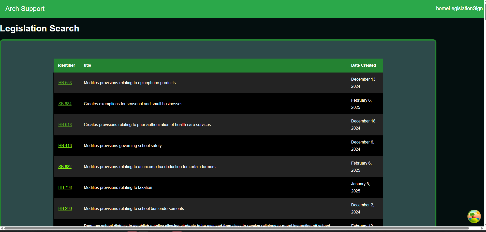
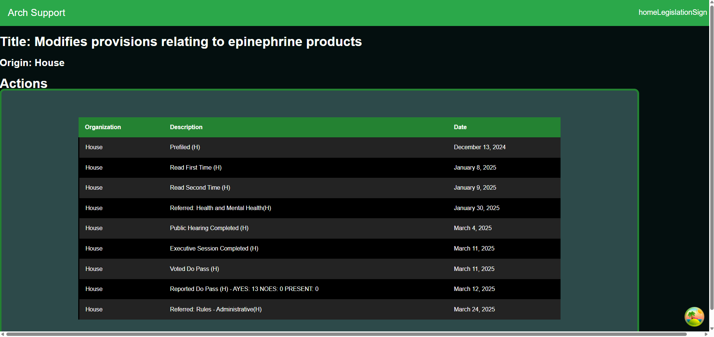

# Arch Support UI

## 🚧 Work in Progress 🚧

UI that shows legislation data in Missouri.

## Table of Contents

1. [Introduction](#introduction)
2. [Installation and Local setup](#installation-and-local-setup)
3. [Future Features](#future-features)
4. [Images](#images)

## Introduction

Arch Support UI is a tool designed to provide users with easy access to Missouri's legislative data. With this application, users can track current legislation, view who is sponsoring or supporting bills, and monitor their statuses throughout the legislative process.

Currently, there is no backend service or database to suppport this UI so in the meantime legislative data for this tool is being pulled via Plural Policy's Open States API.

## Installation and local setup

First make sure you have the latest version of node JS then open the project.
In order to access the API, you will need to create an account with plural policy to receive an api key which will allow access to their service. Once an account is created, use the X-API-KEY provided and create a .env.dev file containing the following

```
VITE_API_KEY=<YOUR API KEY>
VITE_API_URL=https://v3.openstates.org
```

You can then run the following commands in your terminal

```
npm install
npm run dev
```

## Future Features

1. adding search bar and table sorting to legislation page.

2. expanding details displayed when selecting a bill

3. update site styling

4. Account creation to support legislation tracking.

5. Adding events page.

# Images

### Current Legislation Search page



### CurrentScreen displayed when clicking on a bill


